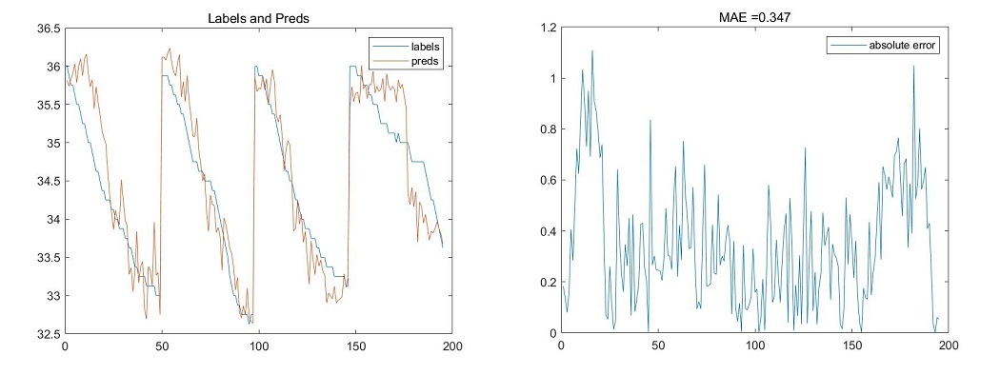
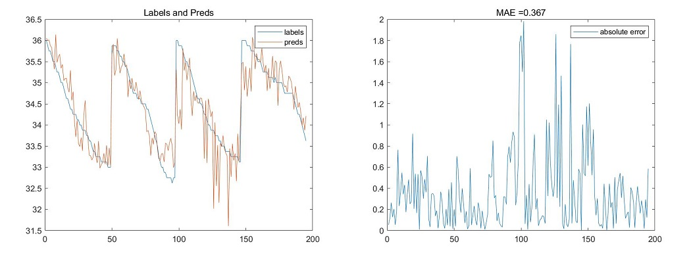
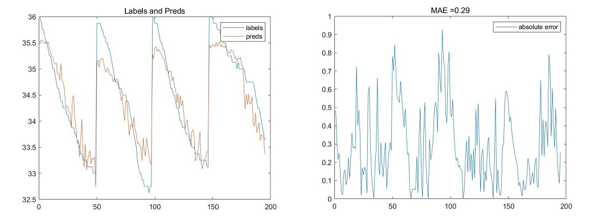

# temperature_regression
> Put scanned hand back images into DenseNet201 to predict the inside temperature [with inside factor[add at the beginning / end] / without factor K].

---

## Input:

+ Image: large quantities of images of scanned hand back | 3d arrays.
+ K_factor: a factor which reflects the property of the indoor environment | scalars.

## Method:

### Network:

Based on the DenseNet201, which is then modified into a regression model:

0. Inputs: {scanned_hand_back_images[, indoor_factor_K]}, outputs:{temperature_prediction},

1. Modification 0: Only images;
2. Modification 1: At the beginning, expand the scalar and then use the 1x1 convolution to combine the channels of images and Ks from 4 channels into 3 ones, which can be directly used into DenseNet201;
3. Modification 2: 1st flow -- image data jump into the DenseNet201, 2nd flow -- scalar K is expanded into a 2d array, then do some 1D conv and 1D pooling. At the end, concatenate these two flows into some additional dense layers;

### Data format:

#### An example in scene 1:

K: 97.1443351260611,

Image_1:

Results:

Now the result is sort of acceptable after **2** epoch and some fine-tuning over the training dataset**(6, 7, 8, 9, 10, 11, 12, 14, 15, 16, 18, 19)**(with interpolation), and the MAE error on the test set**(13, 17, 20, 21)**(without interpolation) shows above:

| Method_K | no    | head  | tail |
| -------- | ----- | ----- | ---- |
| **MAE**  | 0.347 | 0.367 | 0.29 |

> Without K

>  With K at the beginning.

> With K conjuncted before the additional dense layers at the end.

