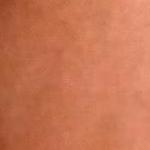
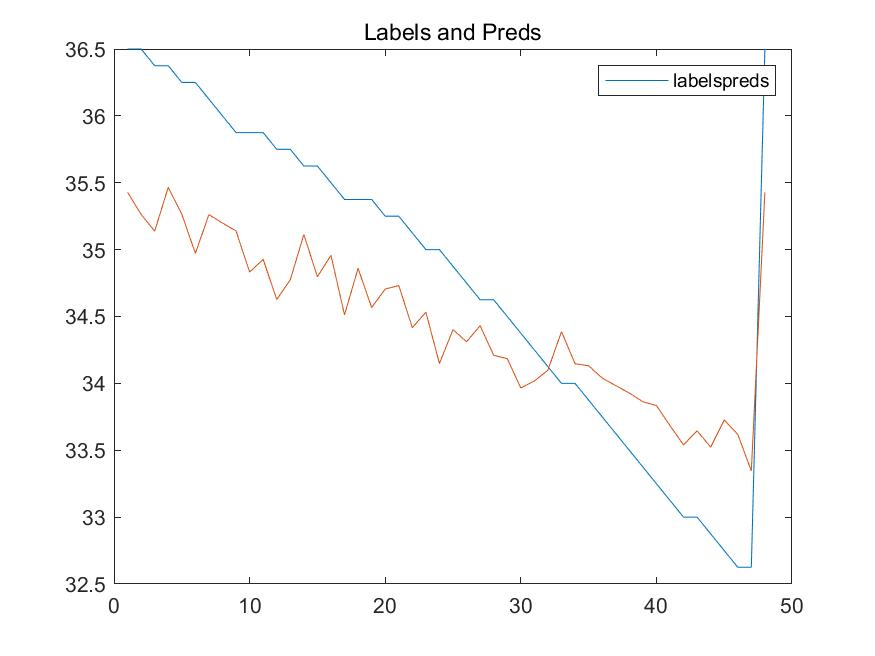
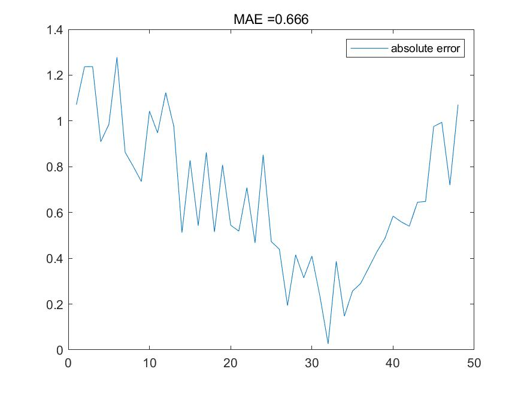

# temperature_regression
> Put scanned hand back images into InceptionV4 to predict the inside temperature [with inside factor[add at the beginning / end] / without factor K].

---

## Input:

+ Image: large quantities of images of scanned hand back | 3d arrays.
+ K_factor: a factor which reflects the property of the indoor environment | scalars.

## Method:

### Network:

Based on the [Inception-v4](https://github.com/kentsommer/keras-inceptionV4), which is then modified into a regression model:

0. Inputs: {scanned_hand_back_images, indoor_factor_K}, outputs:{temperature_prediction},

1. Modification 0: Only images,
2. Modification 1: At the beginning, expand the scalar and then use the 1x1 convolution to combine the channels of images and Ks from 4 channels into 3 ones, which can be directly used into Inception-v4.
3. Modification 2: At the end, concatenate the image flow and K into some additional dense layers.

### Data format:

#### Example:

In scene 1:

K: 97.1443351260611,

Image_1:

Results:

Now the result is sort of acceptable after **1** epoch over the whole dataset:

> Without K

> With K conjuncted before the additional dense layers at the end.

